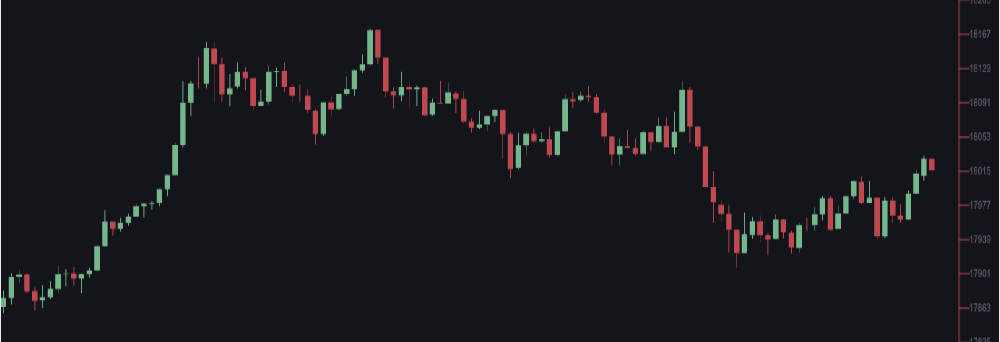

# Binance FE Test Submission
This is my submission to Binance's Front End developer test #1. I built a script that pull historical data and subscribes to a stream, it graphs the historical data on a kline graph and appends new payloads from the stream on an organic canvas element. Here is a screen shot of the project.

## Demo
You may visit this project [demo here](https://abdu997.github.io/binance-fe-test/).

## What I would change if I had more time?
- I would make my script more efficient
- I would more on the styling of my graph
- I would figure out how to handle new payloads that match the timestamp of a past payload.
- I would work on the scale of the Y-axis

